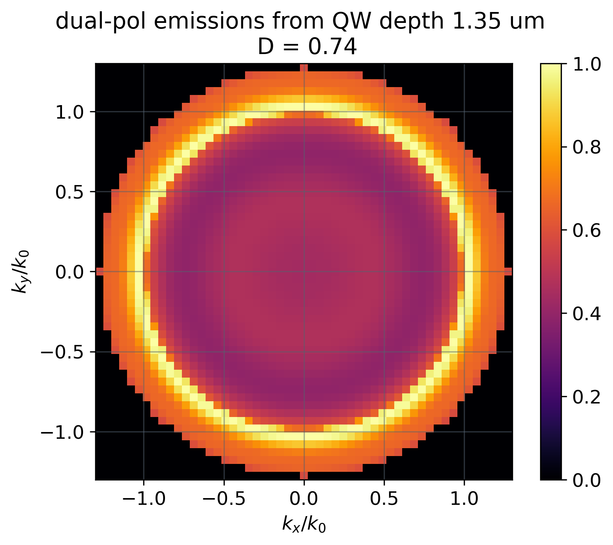
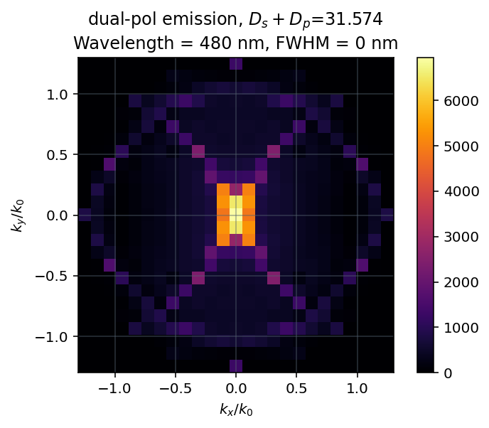

# Meta-LED Optimization

**Designing a nanostructured LED (meta-LED) that emits light in a chosen direction — not in all directions at once.**


| Before: unpatterned thin-film LED (D = 0.74) | After: optimized meta-LED (D<sub>s</sub> + D<sub>p</sub> = 31.6) |
| :---: | :---: |
|  |  |
| Emission spread over (almost) every angle | Emission concentrated tightly at the target direction |

Both plots show emitted intensity vs. in-plane wavevector `(kx/k0, ky/k0)` — the same
momentum-space view used throughout this repo's [directivity](#how-it-works) calculations.

---

## Overview

A standard LED radiates spontaneous emission into (almost) every angle, which wastes light
that never reaches a detector, fiber, or viewer at the angle you actually care about. This
project designs a **meta-LED**: a GaN-based LED etched with a
subwavelength nanostructure — parallel **nanoribbons** (optionally with rectangular **notches**
cut into their sides), or alternatively an array of **nanoholes**/**pillars** — so that emission
is redirected into a target angle (e.g. straight up, or steered off-normal). Given the structure 
of the code, you should also be able to target any linear polarization, though I haven't tested 
that yet.

The geometry — positions, widths, depths (all in the tens-to-hundreds-of-nm range) — is treated
as a continuous design space and searched over automatically. Every candidate design is
fabrication-aware: geometric constraints enforce realistic minimum trench/mesa/wall widths
(~50-100 nm) so the optimizer can't propose something impossible to fabricate.

This repository contains **two independent implementations of the same design method**, built
around different Maxwell solvers (see [Repository structure](#repository-structure)):

- **`S4/`** — the open-source [S4](https://github.com/victorliu/S4) Fourier Modal Method / RCWA
  solver, for the ribbon+notch geometry only.
- **`LumRCWA/`** — Lumerical's commercial RCWA solver (via its `lumapi` Python API), covering
  both the ribbon+notch geometry and the nanohole/pillar alternative, with a more developed
  figure-of-merit (multiple FoM definitions, multi-wavelength spectral averaging, multiple
  quantum wells).

## How it works

**1. Directivity via reciprocity.** RCWA solvers can't simulate a spontaneously emitting dipole
directly, so the figure of merit is computed via the reciprocity theorem instead: a plane wave
is launched into the structure from a given in-plane wavevector `(kx, ky)` and polarization, and
the resulting field intensity at the quantum-well location is proportional to how much power a
dipole there would radiate into that outgoing direction. Sweeping `(kx, ky)` over the collection
numerical aperture and normalizing the intensity at the target direction against the average
over the full aperture gives the **directivity, D**.

**2. A dual-polarization figure of merit.** Directivity is computed separately for s- and
p-polarization (`Ds`, `Dp`). Both implementations support combining them as:

```
D = Ds + Dp - |Ds - Dp|
```

which rewards designs that are directional in *both* polarizations simultaneously, rather than
rewarding a design that's extremely directional in one polarization while staying diffuse in
the other. 

`LumRCWA/` additionally supports two other FoM definitions — `Ds + Dp` and
`Ds*Dp/(Ds + Dp)` — selectable via `params['FoM_definition']`.

**3. Bayesian optimization over the geometry.** [Ax](https://ax.dev/) drives the search with a
two-phase strategy in both implementations: an initial Sobol (quasi-random, space-filling) sweep
to explore the design space broadly, followed by BoTorch (Gaussian-process-based Bayesian
optimization) trials that exploit the accumulated data to propose increasingly promising
geometries. Each candidate is built and solved by the relevant RCWA backend, and its directivity
is fed back to Ax as the trial outcome to maximize.

In `S4/`, each evaluation runs in its own subprocess purely to force memory cleanup between S4
calls (S4's Python bindings otherwise leak memory over long optimization runs) — a workaround,
not a parallelization strategy. `LumRCWA/` does not need this, since it reuses a single
long-lived Lumerical session (`lumapi`) across trials instead.

## Repository structure

| Path | Contents |
| --- | --- |
| `S4/` | RCWA implementation on the open-source S4 solver: structure builder (`makeS4structure.py`), reciprocity/figure-of-merit code (`directivity.py`), the Ax optimization driver (`dOpt.py`), design-variable and constraint definitions (`vars_and_constraints.py`), and supporting plotting/analysis scripts. Ribbon+notch geometry only. |
| `LumRCWA/nanonotches/` | The same ribbon+notch geometry, on Lumerical's RCWA solver instead of S4 (`directivity.py`, `dOpt.py`, `plotting_optimization_results.py`). |
| `LumRCWA/nanoholes_or_planarized-pillars/` | An alternate geometry — a periodic array of etched holes or standing pillars instead of ribbons — switched via a `params['geometry']` flag (`'holes'` or `'pillars'`), same Lumerical-solver / Ax-driven pipeline otherwise. |
| `LumRCWA/convergence-testing/` | A numerical-convergence study sweeping Fourier order, xy mesh, z mesh, and k-space mesh resolution against runtime and computed directivity, to choose settings that are accurate but not needlessly slow. |
| `docs/images/` | Example images of LED emission before & after optimimzation. |
| `with-ribbon-placement-error/` | Earlier/broader project history: first working reciprocity pipeline, fabrication-tolerance sensitivity studies, and off-normal beam-steering exploration. Also local run output, not tracked in git. |

## Setup

Install the pure-Python dependencies:

```bash
pip install -r requirements.txt
```

**The RCWA solvers themselves are not pip-installable** and must be set up separately:

- **S4**: a compiled Maxwell solver (the Stanford Stratified Structure Solver). Build it (or a
  maintained fork) from source and make sure its Python bindings are importable as `import S4`.
- **Lumerical**: requires a licensed local Lumerical install; `lumapi` is imported by adding the
  install's `api/python` directory to `sys.path` (see the top of `LumRCWA/*/directivity.py` —
  currently hardcoded to a couple of local install paths, so update those for your machine).

Note that `S4/` and `LumRCWA/` were developed against different versions of the Ax API
(`ax.modelbridge.*` in `S4/dOpt.py` vs. the newer `ax.generation_strategy`/`ax.adapter.*` in
`LumRCWA/*/dOpt.py`) — if you need to run both backends, you may need separate environments
with different `ax-platform` versions rather than one shared install.

## Usage

Neither implementation has a command-line entry point — the driver scripts are written to be
run interactively (Spyder/Jupyter "run cell by cell" style), not invoked as `python dOpt.py`.

**S4**, from an interactive session with `S4/` on your path:

```python
import dOpt

# Launch a fresh Bayesian-optimization run over the geometry defined in
# vars_and_constraints.py:
data, client = dOpt.D_opt(dim, var_2d, params_2d, constraints,
                          (training_count, learning_count))
```

```python
import directivity, makeS4structure

# Visualize the emission pattern of one specific design:
directivity.plot_at_QWz_2d(
    makeS4structure.struct_2d(params_2d), params_2d, QW_depth, correct_apod=True
)
```

`S4/plotting_optimization_results.py` and `S4/plot_total_emission_across_spectral_FWHM.py` are
similarly interactive: they expect a `data.npy` trial history (or an already-computed intensity
array) to already be loaded in the workspace.

**LumRCWA**, from an interactive session with `LumRCWA/nanonotches/` (or
`LumRCWA/nanoholes_or_planarized-pillars/`) on your path — same `D_opt(dim, variables, params,
constraints, trials)` entry point, plus a standalone `FoM(params, plot=True)` call for
evaluating/plotting one specific design directly:

```python
import dOpt

data, client = dOpt.D_opt(dim, var_2d, params_2d, constraints,
                          (training_count, learning_count))
```

```python
import directivity

# Evaluate and plot one specific design (requires a live Lumerical session):
directivity.FoM(params_2d, plot=True)
```
